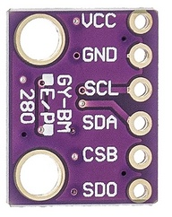
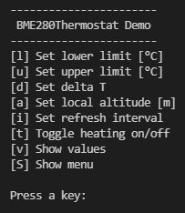

# BME280Thermostat

The BME280 sensor measures temperature, relative humidity and air 
pressure. Fortunately, the libraries Adafruit_Sensor and 
Adafruit_BME280 make it easier for us to read out the measured 
values via the I2C interface. Nevertheless, we want to wrap the 
functionality in a separate class BME280Sensor and supplement it 
with the methods for calculating the dew point and the normal 
pressure for the current altitude. The measured values and the 
results of the calculations should be made available to us by the 
class as a whole in a data structure.

As an application of this, I simulate a thermostat in another class 
BME280Thermostat, which only switches an LED on and off instead of
a heater. Via a simple CLI user interface the measured values can 
be retrieved and the parameters can be changed. 

## Parts

A BME280 Sensor Breakout and of course an Arduino UNO or similar
microcontroller.



## Wiring
       BME280              Arduino UNO
     .--------.          .-------------
    |     Vcc o --->     o 5V
    |     GND o --->     o GND
    |     SCK o --->     o A5
    |     SDA o --->     o A4
    |     CSB o          |
    |     SDO o          |
     `--------´          `-------------

## Class BME280SensorData
This class provides all relevant data. The values shown indicate 
default values.
```
class BME280SensorData
{
    public:
        float tCelsius    = 20.0;    // sensor reading
        float relHumidity = 40.0;    // sensor reading
        float pLocal      = 975.0;   // sensor reading
        float dewPoint    =   6.0;   // calculated dewpoint for temperature=20°C and humidity=40.0%
        float aLocal      = 453.0;   // user defined local altitude
        float npLocal     = 960.0;   // calculated normal air pressure for local altitude=453müM
        float pSeaLevel   = 1013.25; // standard air pressure at sealevel
};
```
## Class BME280Sensor
```
class BME280Sensor : public Adafruit_BME280
{
    protected:
        uint8_t          _i2cAddress;
        BME280SensorData _sensorData;

    public:
        BME280Sensor(uint8_t i2cAddress) : Adafruit_BME280(), _i2cAddress(i2cAddress) {}
        bool begin();       // to be called in setup of main program
        void readSensor();  // updates measurements into BME280SensorData
        void getSensorData(BME280SensorData &data);  // copy measurements into the variable data
        void setLocalAltitude(float meter);          // set the local altitude in meters above sea level
        void printSensorData();                      // print measurements to the monitor

    private:
        float   calculateDewPoint();
        float   calculateNpLocal();
};
```

## Class BME280Thermostat
```
class BME280Thermostat : public BME280Sensor
{
    private:
        static void _nop(){};
        BME280ThermostatData  _data;
        CallbackFunction _onLowTempReached  = _nop;
        CallbackFunction _onHighTempReached = _nop;
        CallbackFunction _onDataReady       = _nop;

    public:
        BME280Thermostat(uint8_t i2cAddress) : BME280Sensor(i2cAddress) {}

        void setRefreshInterval(uint32_t msRefresh);
        void setLimitHigh(float tHigh);
        void setLimitLow(float tLow);
        void setTempDelta(float delta);
        void getThermostatData(BME280ThermostatData &data);
        void loop();
        void addOnLowTempReachedCB(CallbackFunction cb);
        void addOnHighTempReachedCB(CallbackFunction cb);
        void addOnDataReadyCB(CallbackFunction cb);
        void printThermostatData();
};
```


## User Interface (CLI)


