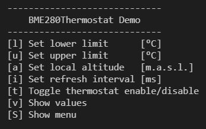
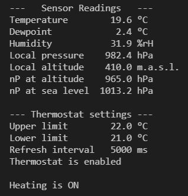

# BME280Thermostat

The BME280 sensor measures temperature, relative humidity and air 
pressure. Fortunately, the libraries Adafruit_Sensor and 
Adafruit_BME280 make it easier to read out the measured 
values via the I2C interface. Nevertheless, I want to wrap the 
functionality in a separate class ***BME280Sensor*** and supplement it with the methods for calculating the dew point and the normal 
pressure for the current altitude. We want to query measured values and calculated quantities by appropriate methods.

As an application of this, I simulate a thermostat in another class 
***BME280Thermostat***, which only switches a LED on and off instead of a heater. The measured values can be queried and the parameters changed via a simple CLI menu. 

## Parts

A ***BME280 Sensor Breakout*** and of course an ***Arduino UNO***, a ***Wemos D1*** or an ***ESP32 DevKit V1***.


## Wiring
                           Arduino UNO
       BME280              Wemos D1               ESP32
     .--------.          .------------      .------------
    |     Vcc o --->     o 3V3              o 3V3
    |     GND o --->     o GND              o GND
    |     SCK o --->     o A5               o GPIO_NUM_22 
    |     SDA o --->     o A4               o GPIO_NUM_21
    |     CSB o          |                  |
    |     SDO o          |                  |
     `--------´          `------------      `------------

## Class BME280Sensor
This class provides all relevant data through appropriate methods.
```
class BME280Sensor : public Adafruit_BME280
{  
    public:
        BME280Sensor(uint8_t i2cAddress) : Adafruit_BME280(),
                    _i2cAddress(i2cAddress) {}

        void  setup();
        float getCelsius();
        float getFahrenheit();
        float getRelHumidity();
        float getDewPoint();
        float getLocalPressure();
        float getLocalAltitude();
        void  setLocalAltitude(float altitude);
        void  calibrateForAltitude(float altitude); 
        void  printSensorValues();
```

## Class BME280Thermostat
```
using Callback = void(&)(); // Declaration of a reference to a
                            // callback function that must be 
                            // provided by the user.
  
class BME280Thermostat : public BME280Sensor 
{
  public:
    BME280Thermostat(uint8_t i2cAddress, Callback onLowTemp, 
                     Callback onHighTemp, Callback onDataReady) : 
                     BME280Sensor(i2cAddress), 
                     _onLowTemp(onLowTemp), _onHighTemp(onHighTemp),
                     _onDataReady(onDataReady) {}

    void setup();     // to be called in the main setup
    void loop();      // to be called in the main loop
    void enable();    // enable switching on/off of the thermostat 
    void disable();   // disable switching on/off of the thermostat
    bool isEnabled(); // query on/off state of the thermostat
    void setRefreshInterval(uint32_t msRefresh);  // msec
    void setLimitLow(float tLimitLow);            // °C
    void setLimitHigh(float tLimitHigh);          // °C
    float getLimitLow();
    float getLimitHigh();
    uint32_t getRefreshInterval();
    void printSettings();
```

## User Interface (CLI)
The function of the thermostat can be tested via a CLI menu. The measured values and the settings are displayed. 





## Program
The program can be compiled for all 3 microcontrollers by simply switching the PlatformIO Project Environment.